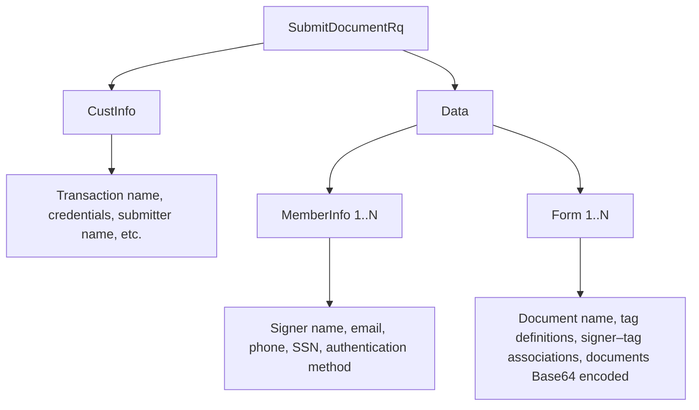
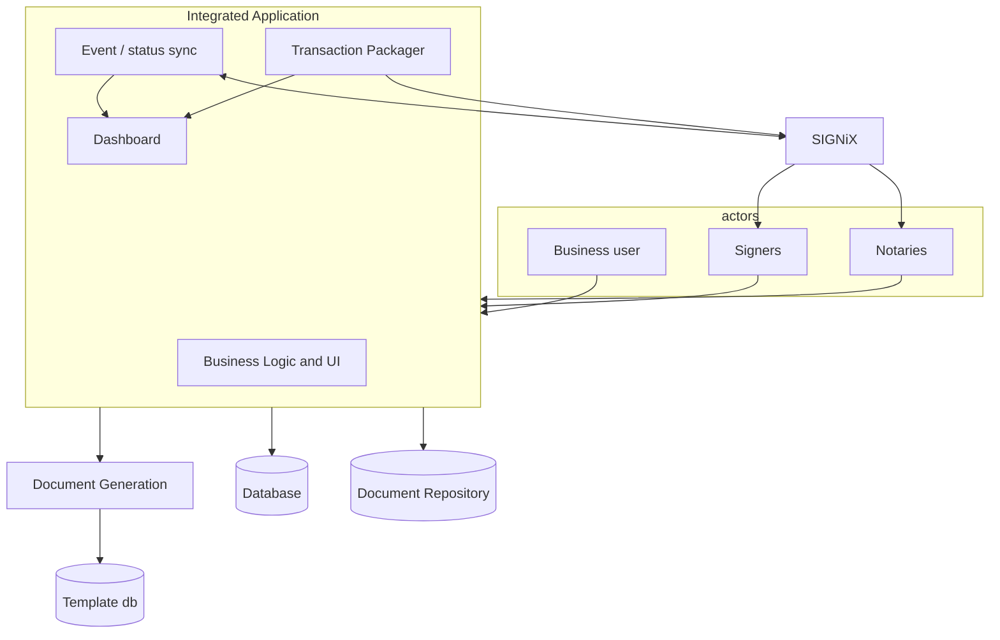

# SIGNiX and the Flex API — Knowledge Base

This document summarizes SIGNiX and the SIGNiX Flex API (Flex API) for use when developing SIGNiX integration in this application.

> **Flex API documentation**  
> The official documentation for the Flex API is at **[https://www.signix.com/apidocumentation](https://www.signix.com/apidocumentation)**. When implementing SIGNiX integration, follow the links on this page and related pages to get details on how the Flex API works and the structure of API calls and responses (e.g. SubmitDocument, DownloadDocument, GetAccessLink, transport, authentication, status codes).

**Key terms and API calls**

> **This application’s submit design**  
> For the lease app’s submit flow (SubmitDocument, signer identification, configuration, data sourcing), see **DESIGN-SIGNiX-SUBMIT.md**. That design defines where every SubmitDocument field comes from and how the first signer’s link is used (separate window).

- **Transaction** — In the Flex API, a *transaction* is the set of documents and parties sent in one SubmitDocument call. SIGNiX returns a **DocumentSetID**; the client may also send a **TransactionID** (client-chosen) to identify the set.
- **SubmitDocument** — Creates and starts a transaction; sends documents, signers, authentication, and field assignments to SIGNiX.
- **DownloadDocument** — Retrieves completed, signed PDFs and the audit trail after a transaction is complete.
- **ConfirmDownload** — Confirms receipt; required for retention policies (e.g. when using DelDocsAfter). Call after successfully storing documents.
- **GetAccessLink** — Returns a short-lived or permanent URL for the submitter (wizard) or a **signer** (signing experience). Commonly used to obtain the **first signer’s** signing URL so the integrating application can open it in a **separate window** (e.g. `window.open`), avoiding iframe limitations (e.g. on iOS) while keeping the user in the app.
- **Push notifications** — Webhooks from SIGNiX to your system for events such as Send, partyComplete, complete, suspend, cancel, expire.

---

## What is the SIGNiX Flex API?

The Flex API is a comprehensive, powerful, and flexible API for driving the SIGNiX digital signature platform, including notary features.

**Capabilities include:**

- **Creating transactions**
  - Specify signers and authentication method
  - Upload documents
  - Associate data fields, signature tags, and actions to signers
- **Access links to embed platform UI elements**
  - Manually configure transaction, add documents, etc.
  - Signing experience
- **Automatic orchestration** — signing workflow, sending emails to signers, etc.
- **Download signed documents**
- **Configure notary sessions**

**Technical characteristics:**

- Standard and secure web protocols (e.g. HTTPS)
- **Commands** (Remote Procedure Calls) and **Notifications** (push notifications / webhooks / events)
- Primarily uses **XML** for API request body and responses
- Advanced options for digital billboard, fine control, etc.
- Exposes the full functionality of the SIGNiX platform: digital signature, Fraud Alert, white labeling, and more.

---

## How To Use The Flex API

### Flex API Credentials and Endpoints

- **Flex API credentials are required** for submitting commands.
  - Access to the API must be turned on by Support.
  - Required values: **sponsor id**, **client id**, **workgroup**, **user id**, and **password**. These are assigned by SIGNiX when your account is set up. Sponsor and Client are often the same for small setups; Workgroup can scope access to transactions.

- **Two endpoints:**
  - **Webtest** — for development and non-production  
    `https://webtest.signix.biz/sdd/b2b/sdddc_ns.jsp`
  - **Production** — for live transactions  
    `https://signix.net/sdd/b2b/sdddc_ns.jsp`  
    (SIGNiX documentation also references www.signix.net; same path `/sdd/b2b/sdddc_ns.jsp`.)

**Practice:** Development should always begin in Webtest. Only when a project is completed should it switch to Production. Production should only contain real transactions.

### Transport (how to send requests)

All B2B requests use the **same endpoint URL** and **same transport**; the **method** parameter selects the API call (SubmitDocument, GetAccessLink, etc.).

- **HTTP:** POST with body **MIME type `application/x-www-form-urlencoded`** (form submission).
- **Form parameters** (case-sensitive; use **lowercase**):
  - **`method`** — The web method name: the **outermost XML element name of the request with "Rq" removed**. Examples: for `<SubmitDocumentRq>...</SubmitDocumentRq>` use `method=SubmitDocument`; for GetAccessLink-Signer the outer element name minus "Rq" (e.g. `GetAccessLinkSigner` if the request root is `GetAccessLinkSignerRq`; confirm in Flex API doc).
  - **`request`** — The full request XML string.
- **Response:** HTTP 200 with **Content-Type `text/xml`**; body is the XML response. Parse with ElementTree. Check **StatusCode** first; non-zero means error. On HTTP 4xx/5xx or non-XML response, treat as transport/system error.

**Credentials:** Authentication is **inside the request XML** (CustInfo). No separate HTTP auth header; same endpoint and POST format for all methods.

### SubmitDocument — Response XML

- **Status:** `Status` with `StatusCode` (0 = success; non-zero = error) and `StatusDesc`. Always check StatusCode before using other elements.
- **DocumentSetID:** Present on success; use for GetAccessLink, DownloadDocument, etc.
- **First-party pickup link:** On success, the response may include a pickup link for the first party (URL to the first signer's signing experience). Exact element names are in the Flex API schema; parse for the URL when StatusCode is 0. If present, use as `first_signing_url`; otherwise call GetAccessLink for the first signer.

### GetAccessLink — Signer (first signer URL)

- **Same endpoint** as SubmitDocument; `method` and `request` parameters.
- **Request:** CustInfo (same as SubmitDocument); Data with **DocumentSetID** (from SubmitDocument response) and **MemberInfoNumber** (integer: **1** = first party, **2** = second, etc.). Use **1** for the first signer. Optional: PermanentLink=true for a long-standing link.
- **Response:** On StatusCode 0, response contains the signer URL; exact element name per schema. Use as `first_signing_url`.

Request only one GetAccessLink at a time; use MemberInfoNumber=1 for the first signer when the SubmitDocument response does not include the first-party link.

---

**Typical integration flow**

1. **Build and submit** — Your application builds the transaction (documents, signers, authentication, field assignments) and calls **SubmitDocument**. SIGNiX returns a DocumentSetID.
2. **Signers get access** — Either SIGNiX sends email to signers with a link, or your application uses **GetAccessLink** (e.g. to embed the signing experience or send your own notification).
3. **Progress and completion** — **Push notifications** (webhooks) inform your system when events occur (e.g. partyComplete, complete). Alternatively you can poll with QueryTransactionStatus.
4. **Retrieve and confirm** — When the transaction is complete, call **DownloadDocument** to get signed PDFs and the audit trail, store them in your document repository, then call **ConfirmDownload** so SIGNiX can apply retention (required if using DelDocsAfter).

### SubmitDocument call

**SubmitDocument** transfers the full transaction to SIGNiX:

- **Sent in the request:** signer info, PDF document(s), and tasks to complete (a task is usually “get signer to complete this field”).
- **Returned in the response:** a SIGNiX **DocumentSetID** (used in future API calls) and a link to the first signing experience.
- **After a successful call:** a **push notification** (“Send”) is sent to the integrating system indicating the transaction was sent, and SIGNiX automatically sends an email to the first signer with an invitation to the signing session.



---

### Building XML requests and parsing responses

The Flex API uses **XML** for request bodies and responses. Two common approaches for building request XML are:

- **Template-based** — A Django template (DTL) or similar with placeholders; render with a data dict and send the result. The XML structure is visible in one place and easy to align with vendor examples.
- **Programmatic** — Build a tree with `xml.etree.ElementTree` or `lxml`, then serialize. Better when the structure is highly variable or optional.

**Recommendation for this integration:**

- **Request bodies (e.g. SubmitDocument)** — Prefer a **template**. The envelope is mostly fixed; the template acts as the source of truth and matches the spec. Use a data dict and only mark intentionally embedded XML as safe (see below).
- **Responses** — Always **parse with ElementTree or lxml**. Do not rely on string parsing or regex.
- **Highly dynamic requests** — If a payload has many optional blocks or complex conditionals, building the tree in code (ElementTree/lxml) may be clearer than a template full of ``.

**Escaping and `| safe`:** In Django templates (DTL), `{{ value }}` escapes `<`, `>`, and `&`, which is correct for normal text (names, emails, IDs) and prevents XML injection. Use **`| safe` only** for fields that are intentionally XML (e.g. embedded `<Form>` content). Never use `| safe` on user-controlled plain text.

**Form element and document encoding:** Documents inside the `<Form>` element are sent **base64-encoded** (per Flex API). You may embed the entire Form XML fragment (including base64 document content) via a single placeholder like `{{ data.form | safe }}`. Base64 uses only A–Z, a–z, 0–9, +, /, and =, so it does not require `| safe` for escaping; use `| safe` only because the fragment contains XML tags.

**Form structure (Flex API schema):** The Form element’s **child elements and order** must match the Flex API schema. For **AcroForm (static) PDFs**: use RefID, Desc, FileName, MimeType, then SignatureLine(s) (each with MemberInfoNumber and optional SignField for the PDF field name, and optional DateSignedField/DateSignedFormat for the signature date), then Length, then Data (base64). For **text-tagged (generated) PDFs**: use RefID, Desc, FileName, MimeType, then TextTagField (e.g. DateSigned) and TextTagSignature elements (with AnchorText, AnchorXOffset, AnchorYOffset, Width, Height, MemberInfoNumber, optional DateSignedTagName/DateSignedFormat), then Length, Data. Do **not** use legacy names such as FormID, Title, ContentType, LengthOfData—use RefID, Desc, MimeType, Length per the current schema. See the [Flex API — SubmitDocument](https://www.signix.com/apidocumentation#SubmitDocument) request XML and [Text Tagging](https://www.signix.com/api-text-tagging) documentation.

**Example: SubmitDocument request template (Django / DTL)**

The following template illustrates the structure of a SubmitDocument request. Replace placeholders with your data dict; only the `data.form` field should be rendered with `| safe` if it contains XML.

```xml
<?xml version="1.0" ?>
<SubmitDocumentRq xmlns="urn:com:signix:schema:sdddc-1-1">

    <CustInfo>
        <Sponsor>{{ data.cust_info.sponsor }}</Sponsor>
        <Client>{{ data.cust_info.client }}</Client>
        <UserId>{{ data.cust_info.userId }}</UserId>
        <Pswd>{{ data.cust_info.password }}</Pswd>
        <Workgroup>{{ data.cust_info.workgroup }}</Workgroup>
        <Demo>{{ data.cust_info.demo }}</Demo>
        <DelDocsAfter>{{ data.cust_info.del_docs_after }}</DelDocsAfter>
        <EmailContent>{{ data.cust_info.email_content }}</EmailContent>
    </CustInfo>

    <Data>
        <TransactionID>{{ data.transaction_data.transactionId }}</TransactionID>
        <DocSetDescription>{{ data.transaction_data.doc_set_description }}</DocSetDescription>
        <FileName>{{ data.transaction_data.filename }}</FileName>
        <SubmitterEmail>{{ data.submitter.email }}</SubmitterEmail>
        <SubmitterName>{{ data.submitter.name }}</SubmitterName>
        <ContactInfo>{{ data.transaction_data.contact_info }}</ContactInfo>
        <DeliveryType>{{ data.transaction_data.delivery_type }}</DeliveryType>
        <SuspendOnStart>{{ data.transaction_data.suspend_on_start }}</SuspendOnStart>

        
        <MemberInfo>
            <RefID>Signer {{ loop.index }}</RefID>
            <SSN>{{ signer.ssn }}</SSN>
            <DOB>{{ signer.dob }}</DOB>
            <FirstName>{{ signer.first_name }}</FirstName>
            <MiddleName>{{ signer.middle_name }}</MiddleName>
            <LastName>{{ signer.last_name }}</LastName>
            <Email>{{ signer.email }}</Email>
            <Service>{{ signer.service }}</Service>
        </MemberInfo>
        

        {{ data.form | safe }}
    </Data>
</SubmitDocumentRq>
```

For the exact elements and attributes required by SubmitDocument (and other commands), see the [Flex API documentation](https://www.signix.com/apidocumentation).

### SubmitDocument: field notes (from integration experience)

These notes clarify how key fields are typically used when building SubmitDocument in an integrating application. Confirm against the Flex API documentation for your environment.

- **TransactionID** — Client-chosen identifier for the transaction. Should be **unique per transaction** (e.g. include a timestamp or UUID). Used for idempotency and correlation with your records. SIGNiX returns DocumentSetID; TransactionID is what you send.
- **DocSetDescription** — Human-readable label for the transaction (e.g. shown in SIGNiX dashboards or signer email subject). Use **ASCII hyphen** between parts (e.g. "Deal #123 - Lease Documents") to avoid encoding issues in email subjects; avoid Unicode en dash or em dash.
- **Submitter vs first signer** — The **submitter** (SubmitterName, SubmitterEmail in the Data block) is the party initiating the transaction; Flex typically requires these. The **first signer** is the first Member in the signing order (first MemberInfo). GetAccessLink is often called for the **first signer** to obtain the signing URL (so the app can open it in a separate window); the submitter and first signer may or may not be the same person. Store submitter details in configuration when the same identity is used for all submissions.
- **Submitter phone** — If the API or your configuration requires a submitter phone number, use a configured value or a sensible default (e.g. a main line) when not provided per transaction.
- **ContactInfo, DeliveryType, FileName** — Purpose and required status depend on Flex API version and configuration. When DeliveryType is required, use a valid enum value (e.g. **SDDDC**). FileName is often per-document (e.g. for download naming).
- **SuspendOnStart** — When **false**, the transaction is sent immediately and signers are notified. When **true**, the transaction is held so the submitter can make changes before signers are invited. Most “submit and send” flows use **false**.
- **MemberInfo — element order** — The Flex API schema requires a **specific order** for MemberInfo children. Typically: RefID, SSN, DOB, FirstName, MiddleName, LastName, Email, then **Service**, then **MobileNumber** (for SMSOneClick, Service must be followed by the mobile number). Include **SMSCount** (0 for SelectOneClick, 1 for SMSOneClick) as required by the schema. Then optional elements (e.g. KBA, Notary) if applicable.
- **MemberInfo — MobileNumber** — **Required for SMS/SharedSecret** (e.g. SMSOneClick). Send the signer's phone in `<MobileNumber>`; omitting it for SMS auth will cause a validation error.
- **MemberInfo — SSN, DOB** — Used for certain authentication methods (e.g. KBA). For **SelectOneClick** and **SMSOneClick**, SSN/DOB can often be omitted or sent with placeholder values; use **DOB format MM/DD/YYYY** (e.g. 01/01/1990) when sending a placeholder. Confirm in the Flex API documentation.
- **MemberInfo — FirstName, MiddleName, LastName** — Flex expects name components separately. Map from your contact/user model (e.g. Contact.first_name, middle_name, last_name or User/LeaseOfficerProfile equivalents). Use blank or a single space for missing middle name if your model has none.
- **Workgroup** — Must match the **exact value** assigned by SIGNiX for your client (e.g. case-sensitive; a typo such as SSD instead of SDD will result in "workgroup does not exist" errors).

---

## High-level integrated architecture

Most SIGNiX solutions follow a similar pattern: the **integrating application is the primary coordinator**, interfacing with SIGNiX for signing and notarization while managing the user experience, document generation, and internal data.

The system starts as an existing **business application** (no signing capability)—the **Business Logic and UI**. Integration extends it with: **Transaction Packager** (prepares and submits transactions to SIGNiX), **Event / status sync** (bi-directional exchange of transaction events and status with SIGNiX), and a **Dashboard** (visualizes the status of signing transactions, populated by Event/status sync and Transaction Packager). The result is the **Integrated Application**: the same business functionality, now with integrated signing and a transaction-status dashboard.



**Components:**

- **Integrated Application** — The extended system. Contains **Business Logic and UI** (the original business application, unchanged in purpose) plus the signing integration: **Transaction Packager** (prepares and submits transactions to SIGNiX), **Event / status sync** (exchanges events and status with SIGNiX), and **Dashboard** (visualizes transaction status; populated by Event/status sync and Transaction Packager). Business users interact here.
- **Document Generation** — Produces documents (e.g. from templates), triggered by the integrated application; uses a **Template db**.
- **Database** — Stores transaction data and participant data.
- **Document Repository** — Stores documents.
- **SIGNiX** — Handles the signing and notarization experience for **Signers** and **Notaries**; receives transactions from the Transaction Packager and exchanges status/events via Event / status sync.

**Signers** and **Notaries** can interact with both the Integrated Application (e.g. dashboard, links, status) and SIGNiX (e.g. signing interface, notary session). The integrated application owns the overall user journey and data; SIGNiX provides signing and notarization as a service.

## Integration components

- **Transaction Packager**
  - Creates a transaction to submit to SIGNiX. Implemented by building the payload and calling **SubmitDocument** (and **AddDocument** when adding documents to an already-created, suspended transaction).
  - The transaction package includes:
    - **Participant data** — signers and (optionally) notary
    - **Documents / forms**
    - **Field info and assignments** — which fields are assigned to which signers / notary
    - **Transaction metadata**
- **Event / Status Sync**
  - Synchronizes data from the signing process with the business application. Typically implemented by subscribing to **push notifications** (webhooks) from SIGNiX; see [Push Notifications](https://www.signix.com/pndocumentation). Alternatively you can use QueryTransactionStatus on a schedule.
  - On completion, calls **DownloadDocument** to retrieve signed / notarized documents and the audit trail, stores them in the document repository, then calls **ConfirmDownload**. ConfirmDownload is required for retention policies (e.g. when using DelDocsAfter in SubmitDocument).
- **Dashboard**
  - Tracks transaction status within the integrated application (populated by Event/status sync and Transaction Packager).

## UI considerations for integrating system

- **Creation / sending of transaction**
  - Selection of documents, signers, and authentication methods.
  - Immediate send, or suspend for further transaction configuration (e.g. any manual document uploads or tagging?).
- **Signing experience, and/or configuration in SIGNiX**
  - Embed in the integrator’s UI (iframe) or access via email. **Note:** Embedding the SIGNiX interface in an iframe has limitations on iOS (third-party cookies); SIGNiX recommends redirecting to SIGNiX rather than embedding when signers may use iOS devices.
- **Dashboard / transaction status tracking**
  - Within the integrator’s UI: how will transaction status be displayed?

---

## SIGNiX Features Only Available Via API

- **Embed parts of the SIGNiX UI**
  - Option to add documents to an automatically generated transaction (e.g. documents not produced by the system’s own doc-gen)
- **Digital Billboard**
  - Highly personalized call-to-action at the end of the signing experience (e.g. promote insurance or deposit account opening after a loan)
- **Text Tagging**
  - Automated tagging of documents for PDFs generated without pre-placed data/signature fields — suited to systems that produce untagged PDFs
- **Fraud Alert instant feedback**
  - Option to get immediate API feedback when a transaction raises fraud flags (e.g. same phone number used for multiple signers)

---

## Use Cases

- **Integrate signing into any process-centric (repeatable) document-based transaction**, including:
  - Wealth management onboarding and transactions
  - Loan origination, account opening, account maintenance
  - Legal contracts and agreements
  - Patient consent, trial applications and management
  - Government forms (permits, exemption requests, licenses, etc.)
  - Employee onboarding, employment contracts, policy acknowledgements
  - Internal processes (requests & approvals, job reports, etc.)
  - Notary use cases (e.g. court documents or where legally required)

- **Typical integration model**
  - Integrations are often built by partners with industry-specific platforms (expertise, resources, technical access)
  - Investment in the integration scales across their customer base
  - SIGNiX acts as both a solution component and a revenue opportunity
  - SIGNiX owns the solution’s user interface and is well positioned to integrate

---

## Discovery, Design and Planning

Before implementation, address the following areas and questions. They shape transaction creation, execution, completion, and the integration environment. Many of these decisions map to Flex API parameters and options; see the [Flex API documentation](https://www.signix.com/apidocumentation) for request/response details.

### Transaction creation

- **Types of transactions involved, volumes, etc.** — Understand business use cases and expected scale.
- **Current and desired business process and transaction flow** — Map how transactions work today and how they should work with SIGNiX.
- **Forms / documents to be completed / signed**
  - How will they be generated? (e.g. dynamically, uploaded, templated.)
  - How will they be tagged? (e.g. manual tagging, text tagging, template-based; see [Text Tagging](https://www.signix.com/api-text-tagging).)
- **Tag types and locations** — Data fields and signature fields; identify all required fields and placement.
- **How are signers determined?** Where does signer data come from? (e.g. CRM, user input, external system.)
- **Authentication required / appropriate** — Choose based on transaction importance and risk (e.g. SelectOneClick, SMS, KBA-ID, IDVerify per Flex API authentication options).
- **Association of tags to signers** — How each field is assigned to which party.
- **Automatically send invites or suspend for manual update?** — Whether to send immediately or hold (e.g. `<SuspendOnStart>` in SubmitDocument) for submitter edits before signers are notified.
- **Enter signing via email link, or embedded in integrating application?** — Signer experience: email pickup link vs. embedded signing (GetAccessLink-Signer, embedding parameters).

### Transaction execution / progress

- **Dashboard and status tracking** — How progress of in-flight transactions is monitored (integrator’s UI vs. SIGNiX; Event/status sync and Dashboard).

### Transaction completion

- **Where are signed documents, etc., permanently stored?** — Archiving and retention after completion; DownloadDocument and ConfirmDownload; document repository and audit trail storage.

### Integration environment

- **Integrating application, interfaces, API endpoints, branding requirements, etc.** — Technical and branding aspects: which APIs, how they connect to the existing app, custom branding (e.g. emails, Digital Billboard).

### Work breakdown, resource assignment and timeline

- **Project management** — Tasks, ownership, and schedule for the integration.

---

## More Information

The following SIGNiX resources contain relevant and useful information for integration work:

| Resource | Description |
|----------|-------------|
| **DESIGN-SIGNiX-SUBMIT.md** (this repo) | This application’s submit flow design: SubmitDocument data sourcing, SignixConfig, signer identification, first signer in separate window. |
| [Getting Started (Dev Community)](https://www.signix.com/development-community-getting-started) | Integrating with SIGNiX: common terms, integration timeline, how SIGNiX works with your business, what you need (XML, web services, Base64, tagging), push notifications, go-live requirements, and best practices. |
| [Push Notifications](https://www.signix.com/pndocumentation) | Push notification (webhook) setup: subscribing, request/response format, actions (Send, partyComplete, complete, suspend, cancel, expire, etc.), failure and retries, server setup, TLS, and implementation process. |
| [Flex API — SubmitDocument](https://www.signix.com/apidocumentation#SubmitDocument:~:text=SubmitDocument%20%2D%20Request%20XML) | SubmitDocument request XML structure and options: CustInfo, Data, MemberInfo, Form, SignatureLine/View, transport, and related capabilities. |
| [Text Tagging (Flex API)](https://www.signix.com/api-text-tagging) | Using text anchors (tags) in PDFs to place signature, date, text, checkbox, and notary seal fields without AcroForm fields; coordinate system and sample SubmitDocument snippets. |
| [Digital Billboard (Flex API)](https://www.signix.com/apidocumentation#digitalbillboard) | Post-signing call-to-action: image, hover image, alt text, and link per signer on the Thank You for Signing page; placement and sizing options. |
| [Authentication / Service Types](https://www.signix.com/apidocumentation) | Per-signer authentication options: SelectOneClick, SMSNoIntent, SMSNoPassword, IDVerifyBiometric, KBA-ID (notary), etc. See Flex API documentation → Additional Information → Authentication / Service Types. |

---

*For implementation details (endpoints, authentication, XML schemas, webhooks, request/response structure), use the [Flex API documentation](https://www.signix.com/apidocumentation) and follow the links there.*
